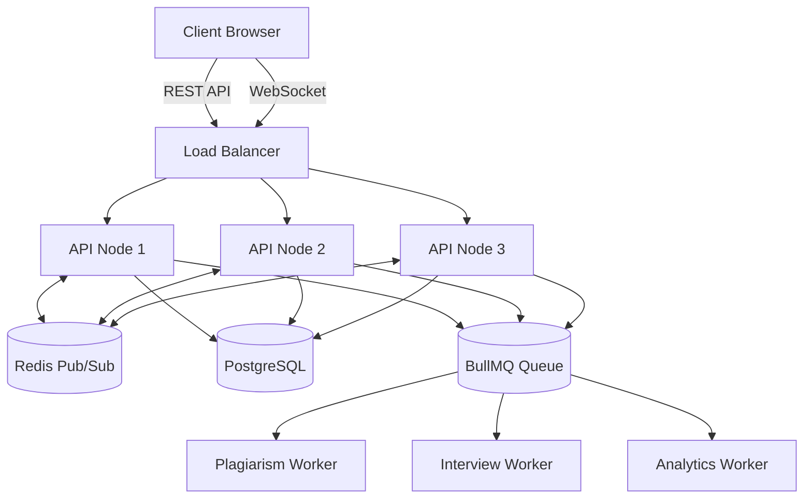

# 🚀 DivineCode Pro

### Distributed Real-Time Algorithmic Training & Technical Interview Platform

> A production-grade platform that combines competitive programming, collaborative coding, distributed systems, AI-powered interviewing, and scalable backend architecture into a single engineering-focused experience.

---

## 🌐 Live Demo

### 🚀 Try It Now

**Live Application:**  
https://divine-code-web.vercel.app/

---

## 📖 Overview

DivineCode Pro is a full-stack platform designed to bridge the gap between traditional competitive programming platforms and real-world technical interviews.

Unlike standard coding platforms, DivineCode Pro combines:

- Real-time collaborative coding
- Distributed WebSocket infrastructure
- AI-powered technical interview simulation
- Automated code execution
- Plagiarism detection pipelines
- Contest and mashup environments

The project was built to demonstrate practical experience with:

- Distributed Systems
- Event-Driven Architectures
- Real-Time Applications
- Background Job Processing
- AI Integration
- Scalable Backend Engineering

---

## ✨ Core Features

### ⚔️ Real-Time Collaborative Multiplayer IDE

Built using Monaco Editor and Socket.io.

Features include:

- Multi-user collaborative coding
- Live cursor synchronization
- Shared coding rooms
- Instant code updates
- Room-based collaboration

To support horizontal scalability, Socket.io is integrated with Redis Pub/Sub, ensuring synchronization across multiple API instances.

---

### 🧠 Voice-to-Voice AI Technical Interviewer

A complete AI-driven interview simulation engine.

Technologies:

- Web Speech API
- Google Gemini 1.5 Flash
- Monaco Editor Context Analysis

Capabilities:

- Voice input
- Voice responses
- Technical questioning
- Follow-up interview rounds
- Code-aware interview feedback

The interviewer evaluates:

- Problem-solving ability
- Coding approach
- Communication skills
- Technical reasoning

in real time.

---

### 🛡️ AST-Inspired Plagiarism Detection

Heavy plagiarism analysis is offloaded to dedicated BullMQ worker nodes.

Pipeline:

```text
Submission
     ↓
Queue
     ↓
Worker Cluster
     ↓
Similarity Analysis
     ↓
Results
```

Detection techniques:

- Tokenization
- N-Gram Generation
- Jaccard Similarity
- Structural Pattern Matching

The engine can identify copied solutions even when:

- Variables are renamed
- Formatting is changed
- Code is slightly modified

---

### 🌐 Live Codeforces Integration

A backend proxy layer provides seamless integration with Codeforces.

Benefits:

- Eliminates browser-side CORS issues
- Normalizes API responses
- Enables custom mashup contests
- Provides unified contest data

---

### ⚡ Distributed Background Processing

CPU-intensive tasks are processed asynchronously using:

- Redis
- BullMQ
- Dedicated Worker Nodes

Examples:

- Plagiarism Detection
- AI Processing
- Contest Analytics
- Session Synchronization

This architecture keeps API response times low and prevents event loop blocking.

---

## 🏗️ System Architecture



---

## 🛠 Tech Stack

| Category | Technologies |
|-----------|-------------|
| Frontend | Next.js, React, TypeScript, Monaco Editor, Framer Motion |
| Backend | Node.js, Express.js, Socket.io |
| Authentication | JWT |
| Database | PostgreSQL |
| ORM | Prisma |
| Cache & Messaging | Redis |
| Queue System | BullMQ |
| AI | Google Gemini 1.5 Flash |
| Code Execution | Judge0 |
| Deployment | Vercel, Docker, Nginx |

---

## 🔥 Engineering Highlights

### Distributed WebSocket Infrastructure

Implemented Redis-backed Socket.io communication allowing users connected to different backend nodes to remain synchronized.

Benefits:

- Horizontal scalability
- Fault tolerance
- Consistent room state
- Low-latency communication

---

### Event Loop Protection

Expensive computations never execute inside API request handlers.

Instead:

```text
API Request
      ↓
BullMQ Queue
      ↓
Worker Cluster
      ↓
Database
      ↓
WebSocket Notification
```

Result:

- Faster APIs
- Improved throughput
- Better scalability

---

### State Synchronization

Maintaining collaborative IDE consistency across multiple server instances required:

- Redis Pub/Sub
- Shared Room Events
- Distributed State Updates

This guarantees all users see identical editor states regardless of which server handles their connection.

---

### Secure Backend Proxy Layer

The Codeforces proxy:

- Sanitizes responses
- Prevents direct client exposure
- Avoids browser CORS restrictions
- Enables centralized rate limiting

---

## 📈 Scalability Design

Designed around horizontal scaling principles.

```text
                     Load Balancer
                           │
          ┌────────────────┼────────────────┐
          │                │                │
          ▼                ▼                ▼

       API-1            API-2            API-3
          │                │                │
          └──────── Redis Pub/Sub ──────────┘
                           │
                      BullMQ Queue
                           │
        ┌──────────────────┼──────────────────┐
        ▼                  ▼                  ▼

    Worker-1          Worker-2          Worker-3
```

---

## 🚀 Recruiter Test Drive

Reviewing for an internship or software engineering role?

Skip account creation and immediately explore the platform.

### Suggested Walkthrough

1. Open the live application.
2. Create or join a coding room.
3. Test collaborative editing.
4. Launch the AI interviewer.
5. Explore contest features.
6. Review real-time synchronization capabilities.

### Live Demo

https://divine-code-web.vercel.app/

---

## ⚙️ Local Development Setup

### 1. Clone Repository

```bash
git clone https://github.com/your-username/divinecode.git

cd divinecode
```

### 2. Install Dependencies

```bash
npm install
```

### 3. Configure Environment Variables

Create:

```bash
apps/api/.env
apps/web/.env
```

Example:

```env
DATABASE_URL=
REDIS_URL=
JWT_SECRET=
GEMINI_API_KEY=
JUDGE0_URL=
```

---

### 4. Start Backend API

```bash
cd apps/api

npm run dev
```

---

### 5. Start Worker Cluster

```bash
npm run worker:start
```

---

### 6. Start Frontend

```bash
cd apps/web

npm run dev
```

---

## 🎯 Future Roadmap

### 🌍 Multi-Language Support

Expanding Judge0 configurations for:

- C++
- Java
- Python
- Go
- Rust

---

### 📡 WebRTC Collaboration

Moving collaborative sessions toward:

- Peer-to-peer communication
- Reduced latency
- Lower server overhead

---

### 👥 Spectator Mode

Planned features:

- Live contest viewing
- Event streams
- Rankings
- Submission tracking

---

### 🤖 AI Code Review Assistant

Future AI enhancements:

- Automated code reviews
- Refactoring suggestions
- Complexity analysis
- Interview performance reports

---

## 💡 What This Project Demonstrates

This project showcases practical engineering experience with:

- Distributed Systems
- Real-Time Collaboration
- Event-Driven Architecture
- WebSocket Infrastructure
- Queue-Based Processing
- Redis Pub/Sub
- Worker Orchestration
- AI Integration
- System Scalability
- Production-Oriented Backend Design

---

## 📸 Screenshots

> Add screenshots or GIF demonstrations here.

```text
assets/
├── homepage.png
├── collaborative-room.png
├── ai-interviewer.png
└── contest-room.png
```

---

## 👨‍💻 Author

# Rahul Kumar Sahoo

**Computer Science & Engineering**  
**Indian Institute of Technology Patna**

### 📧 Email

rahulkumarsahoo1974@gmail.com

### 🔗 LinkedIn

https://www.linkedin.com/in/rahul-kumar-sahoo-0bbaa9328

### 🏆 Codeforces

https://codeforces.com/profile/RKS_Rider

---

## ⭐ Support

If you found this project interesting:

```bash
⭐ Star the repository
🍴 Fork the repository
🚀 Build something amazing
```

---

## 📜 License

This project is licensed under the MIT License.

Feel free to use, modify, and distribute it for educational and professional purposes.

---

<div align="center">

### 🙏 Jai Jagannath 🙏

*"May knowledge, perseverance, and humility guide every line of code."*

</div>
