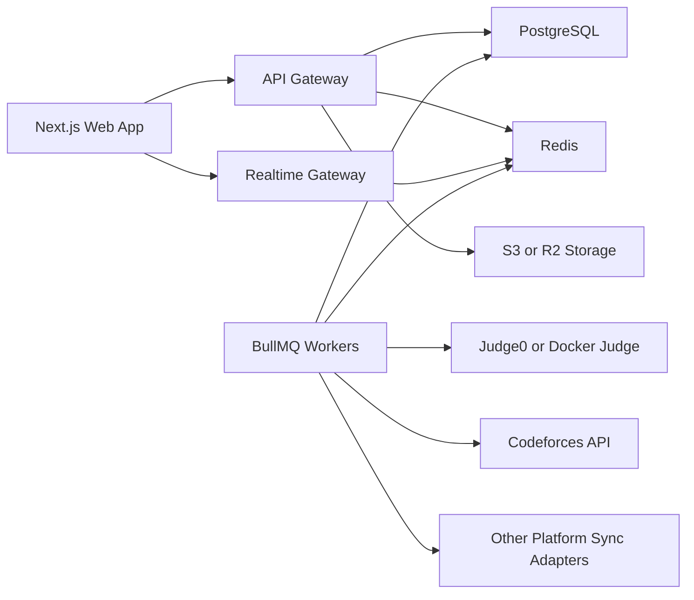
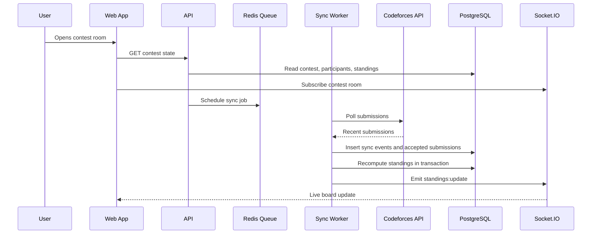

# DivineCode Level 4 V2 Blueprint

## Goal

DivineCode V2 should be a production competitive programming platform, not only a demo wrapper around external links. The platform must support solo practice, group contests, live duels, real judging, external platform synchronization, ratings, recommendations, and interview preparation with a database model that prevents contest anomalies.

## Current Baseline

The current repository builds successfully and already contains:

- Next.js frontend pages for contests, practice, profile, submit, interview, and duel.
- Express API with Socket.IO for live duel rooms.
- Codeforces submission polling through `user.status`.
- Judge0-ready local submission routes.
- MongoDB persistence helpers.
- A Prisma schema folder that was not yet the runtime source of truth.

The V2 direction is to make PostgreSQL and Prisma the canonical data layer, then move runtime endpoints over gradually.

## High Level Architecture

## Services

### Auth and User Service

Responsibilities:

- Signup, login, OAuth, sessions.
- User profile and role management.
- Linked platform handles.
- Handle verification.

Canonical tables:

- `User`
- `ExternalHandle`
- `AuditLog`

### Problem Service

Responsibilities:

- Internal problems.
- External problem references.
- Tags and topic mapping.
- Samples, hidden tests, generators, validators.
- Editorial and official solution storage.

Canonical tables:

- `Problem`
- `ProblemTopic`
- `Topic`
- `Testcase`
- `OfficialSolution`
- `Editorial`

### Judge Service

Responsibilities:

- Queue submissions.
- Execute code through Judge0 first.
- Store verdicts and per-test results.
- Normalize judge output.
- Enforce time and memory limits.

Canonical tables:

- `Submission`
- `SubmissionTestResult`
- `Testcase`

### Contest Service

Responsibilities:

- Solo, group, and mashup contests.
- Invite links.
- Participant and team management.
- Clear owner/player separation.
- Owner-only editing, extension, problem replacement, and deletion.
- Live problem metadata hiding for players.
- Team-scoped submission visibility.
- Problem locking.
- Contest lifecycle.
- Standing calculation.

Canonical tables:

- `Contest`
- `ContestParticipant`
- `ContestProblem`
- `ContestStanding`
- `Submission`
- `AuditLog`

### External Sync Service

Responsibilities:

- Poll Codeforces during live contests.
- Deduplicate external submissions.
- Convert accepted external submissions into internal immutable submission records.
- Recompute standings transactionally.
- Emit realtime updates.

Canonical tables:

- `ExternalSyncJob`
- `ExternalSyncEvent`
- `Submission`
- `ContestStanding`

### Duel Service

Responsibilities:

- Matchmaking.
- Server-authoritative scoring.
- MCQ, debugging, counterexample, code sprint, and hybrid modes.
- Duel history and rating.

Canonical tables:

- `DuelMatch`
- `DuelPlayer`
- `DuelRound`
- `DuelAnswer`
- `RatingHistory`

### Rating and Recommendation Service

Responsibilities:

- Contest rating.
- Duel rating.
- External rating normalization.
- Topic mastery.
- Problem recommendations.

Canonical tables:

- `RatingHistory`
- `TopicMastery`
- `RecommendationSnapshot`
- `ExternalHandle`

### Interview Prep Service

Responsibilities:

- User-selected tracks.
- DSA, OOP, DBMS, compiler, OS, networks, system design, and behavioral prep.
- Progress and spaced repetition.

Canonical tables:

- `InterviewTrack`
- `InterviewQuestion`
- `InterviewProgress`

## Live Contest Sync Flow

## Contest Consistency Rules

These rules prevent most anomalies:

- The contest creator is an owner/admin, not a contestant by default.
- Owners can add themselves as a player only through the normal participant flow.
- Only owners can edit, extend, replace problems, delete a mashup, or see the full editing surface.
- During a live contest, players see problem labels and links, but rating, tags, tutorials, official solutions, and other metadata stay hidden.
- A player can see their own submissions.
- A player can see same-team submissions when `allowTeamSubmissionView` is enabled.
- Same-team submission views expose verdict/activity, not another player's raw code or judge output.
- A player cannot see submissions from other teams during the contest.
- Contest timing is authoritative on the server.
- `startTime`, `endTime`, and `freezeTime` are stored as absolute timestamps.
- Submissions before `startTime` do not count.
- Submissions after `endTime` do not count.
- One accepted solve counts per participant per problem.
- Wrong attempts count only before the first accepted solve.
- Penalty is `acceptedMinute + wrongAttemptsBeforeAccepted * 20`.
- External submissions are deduplicated by `(platform, externalSubmissionId)`.
- Contest problem edits after start require an audit log.
- Standings are recomputed from immutable submissions, not edited directly.
- Socket events are display updates only; database transactions are source of truth.

## First Production Milestone

The first milestone is complete when:

- Prisma schema validates.
- PostgreSQL migration runs locally.
- Contest, problem, testcase, submission, standing, sync, duel, rating, and interview tables exist.
- API can create a contest in PostgreSQL.
- API can create a submission in PostgreSQL.
- Standings can be recomputed from submissions.
- Codeforces sync writes idempotent accepted submissions.
- Socket.IO emits updates after database writes.
